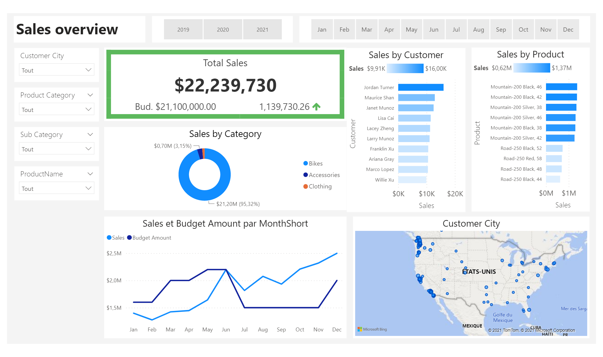

# Sales-Analysis

## Business case 

Steven  - Sales Manager:

We need to improve our internet sales reports and want to move from static reports to visual dashboards.
Essentially, we want to focus it on how much we have sold of what products, to which clients and how it has been over time.
Seeing as each sales person works on different products and customers it would be beneficial to be able to filter them also.
We measure our numbers against budget so I added that in a spreadsheet so we can compare our values against performance. 
The budget is for 2021 and we usually look 2 years back in time when we do analysis of sales.
Let me know if you need anything else!

// Steven

## Dashboard 

  

